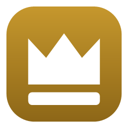

# Taj — the bar



**Taj** (تاج, *"crown"*) is the status bar, and it is already in the box. One bar per
monitor, each reserving its own strip, each able to show a different profile. It is
its own program, `taj`, started by the window manager from the config
(`startup-command "taj"`), and it reads the `bar` section of the same file. The strip
is negotiated with the shell the way the taskbar's is, so a bar that asks for an edge
another docked bar already holds is placed beside it rather than over it, and the
window manager's work area stays honest.

```kdl
bar {
    source "clock" kind="time" format="ddd d MMM HH:mm" interval=500
    source "keyboard" kind="keyboard" interval=250

    profile "default" {
        height 34
        background "#1e1e2e"
        foreground "#cdd6f4"

        zone "left" justify="start" gap=4 {
            workspaces hide-empty=#true active-background="#8dbcff"
        }
        zone "centre" justify="center" grow=1 {
            text template="{{ window.title | truncate:90 }}"
        }
        zone "right" justify="end" gap=12 {
            layout colour="#7f849c" on-click="layout --cycle"
            text template="{{ clock }}" colour="#8dbcff"
        }
    }
}
```

## Widgets without code

**Adding a widget usually needs no code at all.** There are seven widget primitives
— `text`, `workspaces`, `icon`, `layout`, `spacer`, `sparkline`, `meter` — and the
breadth comes from templates, filters and sources rather than from a catalogue you
have to wait for someone to grow:

| What you want | What it costs |
|---|---|
| A new value on the bar | A few lines of KDL |
| Something Taj has never heard of | Any program that writes lines to stdout |
| Genuinely custom drawing | One `IWidget` implementation |

### Sources

A `source` is a value the bar watches. `kind="time"` is a clock, with a `format`, an
optional `timezone` (a Windows id or an IANA one) and an optional `culture` — a BCP 47
name such as `de-DE` or `ar-SA` that decides what `dddd` and `MMMM` come out as;
without one they are English. `kind="keyboard"` is the input language of the window in
front, as a two-letter code. `kind="signal"` is a value another program puts on the
bar by raising a signal, described below. `kind="command"` runs a program, and comes in two shapes:
without an `interval` the program is expected to stay running and every line it prints
is the new value — a program that exits is started again, with a wait that doubles to
a minute if it keeps exiting without printing; with an `interval` the program is
expected to print and exit, and is run again that many milliseconds after it does, its
last non-empty line being the value — the shape a shell one-liner or an i3blocks
script already has. In either shape the `interval` is how often a value is *checked*,
not how often the bar redraws: an unchanged value is suppressed, so a clock showing
minutes can be polled twice a second for a prompt tick without repainting twice a
second.

```kdl
bar {
    source "cpu" kind="command" command="pwsh -NoProfile -File cpu.ps1" interval=2000
    source "berlin" kind="time" format="dddd HH:mm" timezone="Europe/Berlin" culture="de-DE"
}
```

The sources are made once and shared by every bar, so a desk with three displays runs
one clock and one copy of each script, not three. A bar that arrives later — a
monitor plugged in — is given every value the sources already have. A source whose
`kind` the bar does not know, or a `command` with nothing to run, is pointed out at
load (`TAJ0027`, `TAJ0028`), as is a `culture` the machine has never heard of
(`TAJ0032`).

`kind="signal"` is the fourth kind, for a program that already knows the value and
would otherwise have to be started a second time by the bar to say it. It listens for
a [signal](scripting.md#signals) — its own name unless `signal=` says otherwise — and
the signal's arguments are the value, joined by a space; a signal with no arguments is
the empty value, which hides the widget. `shubbak signal battery 87` from any script,
a keybinding or another program makes `{{ battery }}` read `87`:

```kdl
bar {
    source "battery" kind="signal"                     // shubbak signal battery 87
    source "out" kind="signal" signal="speaker"        // the same signal under another name

    profile "default" {
        zone "right" justify="end" {
            text template="{{ battery }}%"
            text template="{{ out | truncate:24 }}"
        }
    }
}
```

The watcher publishes three of its readings this way when its section names them —
the battery's percentage and the names of the default speaker and microphone; see
[Ayn](ayn.md#values). A signal source has no timer, no thread and no process, so it
costs nothing while nobody is publishing; and a bar with no signal source never
subscribes to the topic at all, so the window manager still says when a signal is
raised with nobody listening. Because a signal is fire-and-forget and the window
manager keeps none of it, the bar raises `signal "announce"` when it connects with a
signal source in its file, and again after a reload, and a publisher that hears it
says its values again — so a bar started after the value was last sent is not blank
until it next changes. A publisher of your own honours that by re-sending on
`announce`; one that does not is simply blank until its next change.

Some values need no source at all, because they come from the window manager's event
stream: `{{ window.title }}`, `{{ window.state }}`, `{{ layout }}`, `{{ workspace }}`
(the active workspace's name on this bar's display), `{{ windows }}` (how many windows
that workspace holds), `{{ paused }}`,
`{{ suspended }}`, `{{ binding_mode }}`, `{{ config }}`, `{{ contexts }}`,
`{{ context.<name> }}` and `{{ connection }}`. The last seven are empty almost all of
the time, and a widget whose template renders empty hides itself — so they cost no
room until something is unusual. `{{ connection }}` reads `no window manager` while a
window manager the bar had reached has gone, and nothing before the first connection,
so a bar that wins the race at logon does not open by announcing the window manager
missing.

### Templates and filters

Templates get filters — `truncate:N` `upper` `lower` `trim` `default:X` `then:X`
`pad:N` `replace:from,to` `icon` `state-icon` `map:a=b,c=d` — and a `when { }` block
for conditional styling, so "colour the keyboard indicator red when I'm in the wrong
language" is a line, not a plugin:

```kdl
bar {
    source "keyboard" kind="keyboard" interval=250

    profile "default" {
        zone "right" justify="end" {
            text template="{{ keyboard }}" colour="#7f849c" on-click="keyboard next" {
                when value="HE" colour="#f38ba8" bold=#true
            }
        }
    }
}
```

`when value="X"` matches the drawn text, `when not="X"` everything else, and
`when of="source"` tests a source instead of the text — useful after a filter has
already turned the value into a glyph. First match wins. The `on-click` makes the
indicator a switch as well as a readout; see [Clicking](#clicking).

`map` is the general shape of `icon` and `state-icon`, for values those two were never
going to know: `{{ state | map:on=\u{E720},off=\u{E74F} }}` turns a script's `on` and
`off` into two glyphs, matched without regard to case, and `*=` is the entry for
anything the table does not name. A value the table does not name, and no `*`, passes
through unchanged. For the layout itself there is a better indicator than a glyph; see
[The layout](#the-layout).

### Numbers

A source carries text, and a template can do arithmetic on the number in it: `round`
and `round:N`, `add:N`, `sub:N`, `mul:N`, `div:N`, and `percent` or `percent:of`. Each
reads the first number in the value — so `87%` is eighty-seven and `load: 1.75 avg` is
one and three quarters — and writes a number back, which the rest of the template then
wraps in whatever unit it likes. A value with no number in it, or a division by nought,
passes through untouched for the same reason an unknown filter does: a bar that shows
the raw value is better than one that shows nothing.

```kdl
bar {
    source "mem" kind="command" command="pwsh -NoProfile -File mem-bytes.ps1" interval=5000

    profile "default" {
        zone "right" justify="end" {
            text template="{{ mem | div:1073741824 | round:1 }} GB"
        }
    }
}
```

A `when` block can compare a number too: `when above=80` holds while the value — its
first number, from the drawn text or from the source `of=` names — is strictly greater,
`when below=10` while it is strictly less, and the two together are a band. A value
with no number in it fails a numeric condition, since a battery that has not reported
yet is not below ten percent. Writing `value=` and `above=` or `below=` in one block is
pointed out (`TAJ0034`); a block that names nothing to match is too (`TAJ0033`), as is
a threshold that is not a number (`TAJ0035`).

```kdl
bar {
    source "battery" kind="signal"

    profile "default" {
        zone "right" justify="end" {
            text template="{{ battery }}%" {
                when below=10 colour="#f38ba8" bold=#true
                when above=89 colour="#a6e3a1"
            }
        }
    }
}
```

### Graphs and meters

Two widgets draw a number rather than print it. **`meter`** shows how much of a range a
value is — a bar with a fill along it, or `shape="ring"` for a gauge — and **`sparkline`**
draws a list of numbers as a line, oldest at the left. A bar that reads `23%` is a
figure to read; a bar a quarter full is a shape to see.

```kdl
bar {
    source "cpu" kind="command" command="pwsh -NoProfile -File cpu.ps1" interval=1000 history=60
    source "battery" kind="signal"

    profile "default" {
        zone "right" justify="end" gap=10 {
            sparkline source="cpu.history" width=60 height=14 colour="#8dbcff" fill="#8dbcff40" min=0 max=100 {
                when above=80 colour="#f38ba8"
            }
            meter source="battery" width=40 height=4 colour="#a6e3a1" {
                when below=20 colour="#f38ba8"
            }
            meter source="cpu" shape="ring" size=18 thickness=3 colour="accent"
        }
    }
}
```

A `meter` reads the first number in its `source` and places it between `min` and `max`
— nought to a hundred unless told otherwise — clamped, so a reading past the end fills
the meter rather than spilling out of it. `colour` is the fill and `background` the
track, with a faint track when none is written; `radius` rounds both. A bar is `width`
by `height`, and `direction="vertical"` fills it upward. A ring is `size` across with a
`thickness` stroke, running clockwise from the top; `start=225 sweep=270` is a dial. A
`when` block recolours the fill by the value and leaves the track alone. The meter hides
while the source has no number in it, as a text widget with nothing to say does.

A `sparkline` draws every number in its `source`, which is a list — `12 15 50 50 48`,
spaces or commas between. Where the list comes from is not its business. The usual
answer is `history=N` on the source it graphs: the source then publishes its last `N`
readings as `<name>.history`, including the repeats, so a CPU at a steady fifty is a
flat line and not a line that has stopped. A script that already keeps a history prints
the same shape itself. `colour` is the line, `thickness` its width, `fill` washes the
area under it; `min` and `max` pin the scale, which a percentage should — a CPU graph
scaled to its own range makes a quiet minute look like a storm — and without them the
data is its own. A sparkline on a history takes the history's count as its `points`
unless one is written, so the line fills in from the right over its first minute rather
than two readings being stretched across the whole width. A `when` block tests the
newest reading. A sparkline on `cpu` where `cpu` keeps a history is pointed out
(`TAJ0039`), since it would show one reading for ever; one with no `source=` is an error
(`TAJ0037`), as is a meter's; a scale the wrong way round is dropped (`TAJ0038`), and a
`history` that is not a count from 2 to 1000 keeps none (`TAJ0036`).

Both take the same gestures a text widget does, and hover the same way when they do.

A widget can have a `font=` of its own, which is how one widget draws a glyph from
Segoe Fluent Icons beside text in the profile's face. `{{ contexts }}` names the
contexts the window manager holds, and is empty when none do; `{{ context.meeting }}`
is `meeting` while that one holds and empty otherwise, so
`{{ context.meeting | then:\u{E720} }}` is a microphone glyph that appears for the
call and leaves with it.

### The focused window's icon

```kdl
bar {
    profile "default" {
        zone "centre" justify="center" grow=1 {
            icon size=20
            text template="{{ window.title }}"
        }
    }
}
```

`icon` draws the focused window's icon — the one its taskbar button shows — beside
whatever you put next to it, and hides when nothing is focused, so the title does not
gain a gap. `size` is the square it is drawn in, and four pixels of room around that
square is the pill it shows on hover; in a bar shorter than the two together the icon
is still centred and the room is what the edges clip, so `size=20` in a `height 23`
bar draws the whole picture in the middle. `background` and `radius` put a pill
behind it; `on-click` makes it a control like any text widget. The picture comes over
the pipe like the title does: the bar asks the window manager, which asks the window
(then its class, then its executable) and answers with pixels — see
[`window-icon`](scripting.md#asking). The bar caches each window's icon for a minute
and the window manager for half of one, so switching between the same windows all day
costs one read per window, not one per focus change. `source=` reads another source
that publishes the same shape, for anything else that wants to draw a picture.

### The layout

```kdl
bar {
    profile "default" {
        zone "right" justify="end" {
            layout colour="#7f849c" main-colour="#8dbcff" on-click="layout --cycle" on-right-click="layout --cycle-back" {
                when value="monocle" colour="#f9e2af"
            }
        }
    }
}
```

`layout` draws the active layout as a picture of itself: the workspace, sixteen
pixels across, with a pane for each window the layout would place — the big pane on
the left and the rest dwindling into a corner is the spiral, a column of equal strips
beside it is the master layout, four squares are the grid, one solid square is
monocle. Nothing has to be learnt, which is the difference from
`{{ layout | icon }}`, the older indicator that names each layout with a box-drawing
character: `┤` is a spiral once you know, and three spirals and four master layouts
are more than a character each can tell apart at a glance. The filter is still there
for a bar that wants text.

The picture is the window manager's own arithmetic, not a drawing of it: the bar
arranges a handful of placeholder windows with the same code the desktop is arranged
by, so a grid of five is three over two with the two stretched, exactly as yours is,
and a layout added to the window manager is drawn the day it exists. Four panes by
default, because that is the fewest that tell every layout apart — a spiral of three
is precisely a master layout of three — and a picture that is always the same for a
layout is one the eye comes to recognise. `panes="windows"` follows the workspace
instead, growing a pane as each window opens — but never below `min-panes`, four
unless said, and the panes the workspace does not yet have are drawn faint, at a third
of the colour's opacity. Without the floor, one window was one square in every layout
and the indicator had stopped indicating; without the fading, the floor would be a lie
about the count. With both, one window in a spiral is the large pane solid and the
three it would dwindle into faint, which says the layout and the count at once — the
one thing a fixed four cannot. `min-panes=1` draws the workspace's own count, a single
faint pane when it is empty. `panes=6` is any other fixed count up to nine. `size` is
the square, or `width` and `height` for a box the shape of your monitor; `gap` is the
pixel between panes; `colour` is the panes and `main-colour`, when written, the first
window's — the main one in a master layout, the large one in a spiral — so the shape
has a focal point. `background` and `radius` put a pill behind it and `on-click` makes
it a control like any other; a `when` block recolours the panes by the layout's name.
It hides while the window manager has not said what the layout is, and when it names
one the bar does not know. A `panes` that is neither a count from 1 to 9 nor the word
`windows` is pointed out (`TAJ0040`); so is a `min-panes` that is not a count
(`TAJ0041`), or one written under a fixed count, where it does nothing (`TAJ0042`).

### Colours

Colours are `#RGB`, `#RRGGBB` or `#RRGGBBAA`, or the word **`accent`** — the colour
Windows is set to, in Settings or from the wallpaper — so a bar can follow the machine
instead of hard-coding a blue that stops matching the moment you pick a green. Any
colour may be followed by an opacity: `accent 40%` is a translucent accent pill, and
`#8dbcff 40%` is the same thing spelled for a hex colour. The accent is read when the
config is, and the bar re-reads the config when Windows says it changed, so the
change lands on the bar as it lands on the title bars. The same word works for the
palette's theme and the window manager's focus borders, which are the other two
places colours are written.

### Clicking

Anything with an `on-click` is a control: the pointer becomes a hand and the widget
lights up under it — a pill lightens, a bare glyph gains the same faint pill the
workspaces use — or takes `hover-background` and `hover-colour` of its own. The value
of `on-click` is a command, the same ones a keybinding runs, so clicking a workspace
sends what a keybinding would, `on-click="layout --cycle"` on the layout glyph steps
through the layouts, and `on-click="wm-resume"` on the `{{ suspended }}` pill is the
way back that does not need the keyboard.

The other gestures are settings of the same shape: `on-right-click`,
`on-middle-click` (the wheel pressed), `on-scroll-up` and `on-scroll-down` (the wheel
turned away from you and towards you), and `on-double-click` (the left button twice,
within the time set in the mouse settings). A widget with any of the six is a control
and gets the hand and the hover, so a volume pill that only scrolls still looks like
something to touch:

```kdl
bar {
    profile "default" {
        zone "right" justify="end" {
            text template="{{ volume }}" on-click="exec mixer" on-scroll-up="exec mixer --up" on-scroll-down="exec mixer --down"
        }
    }
}
```

A widget with both `on-click` and `on-double-click` holds its single click for the
double-click time and runs it only if no second press arrives, so the two cannot both
fire — open the mixer, then also mute. A widget with only `on-click` is not made to
wait: its click runs at once, as it always did, and two quick clicks are two clicks.

The `workspaces` widget scrolls on its own: the wheel over it moves to the previous or
next workspace, wrapping at the ends and stepping through the ones `hide-empty` hides
as well as the ones drawn, so a scroll is a step through the display's workspaces and
not only through its pills. `scroll=#false` on the widget turns that off.

Two verbs are the bar's own and never reach the window manager. The first is
`keyboard`: put `on-click="keyboard next"` on the language indicator and clicking it
switches the window in front to its next installed layout — `keyboard previous` goes
the other way, `keyboard he` picks a language by its two-letter code — and the
indicator follows on its next poll. The bar already reads the layout of the window in
front, and changing it is a message posted to that same window, so there is nothing
for the window manager to add.

The second is `media`: `media play-pause`, `media next`, `media previous`,
`media stop`, `media mute`, `media volume-up` and `media volume-down` press the
keyboard's media key of that name, and Windows routes it to whichever player is current
— the one with the transport, be it a player or a browser tab — and to the system
volume, with the same flyout the key gets. Pressing the key rather than running a
program is what makes one pill serve every player. The keybinding spellings
(`media_play_pause`, `volume_up`) are accepted too. A media pill is a few lines:

```kdl
bar {
    source "track" kind="signal"

    profile "default" {
        zone "right" justify="end" {
            text template="{{ track | truncate:30 }}" on-click="media play-pause" on-double-click="media next" on-right-click="media previous" on-scroll-up="media volume-up" on-scroll-down="media volume-down" on-middle-click="media mute"
        }
    }
}
```

A `keyboard` or `media` command the bar cannot perform is pointed out at load
(`TAJ0023`), naming the gesture it was written on.

## Appearance

The bar's surface is drawn with real alpha, so a `background` with an alpha channel is
a genuinely translucent bar, not a darker opaque one — and every pill, hover and
dimmed colour on it composites properly, with anti-aliased corners. What shows
through is up to `backdrop`:

```kdl
bar {
    profile "default" {
        height 34
        background "#181825b3"      // ~70% - the backdrop shows through
        backdrop "acrylic"          // none | mica | acrylic | tabbed
        border "#ffffff14"          // a one-pixel hairline
        // margin 8                 // float the bar off the screen edges...
        // radius 8                 // ...with rounded corners
    }
}
```

- **`background`** takes `#RRGGBBAA`. Fully opaque is the bar there was before;
  `#00000000` is no surface at all, only the text.
- **`backdrop`** asks the compositor for a material behind the translucent pixels:
  `acrylic` blurs whatever is behind the bar, `mica` is a tinted rendering of the
  wallpaper, `tabbed` is Mica's stronger variant. Windows 11 22H2 or later; elsewhere
  the request is ignored and the desktop itself shows through. The material comes
  out dark or light to match the background's own lightness. A backdrop only shows
  through pixels the bar leaves translucent — with an opaque background nothing of it
  is seen. Acrylic is the one to try first: it keeps its blur however the focus
  moves, whereas Mica is a material for windows that are sometimes active, which a
  bar never is.
- **`margin`** floats the bar: inset by that many pixels from the screen edge and
  from both sides, with the desktop showing around it. The strip reserved from other
  windows grows by the same amount on the inner side, so the bar sits in the middle of
  its gap without the window manager's own gaps having to know.
- **`radius`** rounds the bar's corners, anti-aliased. Meant for a floating bar — on a
  docked one it rounds the corners against the screen edge too. With a backdrop the
  material itself is clipped by the compositor, which offers two sizes; `radius 8`
  matches the larger and `radius 4` the smaller.
- **`border`** is a one-pixel line in the given colour: an outline on a floating bar,
  and on a docked one only along the edge that faces the windows.

All five inherit through `extends`, and a variant can set `margin 0` to dock a bar
whose parent floats. `edge "bottom"` puts the bar along the bottom of the display
instead of the top; that inherits too. Text is smoothed in grayscale rather than
ClearType, because ClearType's colour fringes assume an opaque background of known
colour.

A widget's `min-width` and `max-width` bound its box in the flex layout, so a value
that changes width from second to second — a clock with seconds, a percentage — can
be given a floor and stop nudging its neighbours; a `max-width` cuts with an ellipsis
like a shrinking zone does.

### Sizes and displays

Every size in the `bar` section — `height`, `font-size`, `padding`, `margin`,
`radius`, `size`, `gap`, `min-width`, a graph's `width` and `height`, a stroke's
`thickness`, the layout picture's `gap` — is written in device-independent pixels and
scaled to each display's own, so one `height 34` is the same fraction of a 4K display
at 150 percent and a 1080p one at 100 percent, and a bar dragged between them by a
change of scaling in Settings follows without a restart. A display's scale is read
when its bar is made and again when Windows says it changed. Colours, text and
everything the layout measures are scaled together, so what is measured is what is
drawn. `dpi-scaling #false` in `bar` turns this off and the numbers are pixels as
written, which is how every version before this one read them: a config tuned in raw
pixels on a high-DPI display will find its bar half again as large the first time it
loads with the scaling on, and is one line from having it back.

```kdl
bar {
    dpi-scaling #false
    profile "default" { height 51; font-size 27 }
}
```

`extends` naming a profile that does not exist, or one declared further down the
file, is pointed out (`TAJ0029`) rather than quietly falling back to the built-in
look; so is an `edge` or `justify` that is not one of the words (`TAJ0030`), a colour
that does not parse wherever it is written (`TAJ0031`), and a `dpi-scaling` that is not
`#true` or `#false` (`TAJ0026`).

## Profiles, zones and rules

Zones are flex containers with `justify`, `gap` and `grow`; three is a convention, not
a limit. A zone that grows is also the zone that gives: when a window title is longer
than the room, the growing centre zone shrinks and the title is cut with an ellipsis
where its neighbours begin — the clock beside it keeps its width. `truncate:N` is
therefore a stylistic cap rather than a necessity. Profiles can `extend` each other,
so a slim "presentation" variant costs five lines instead of a duplicate:

```kdl
monitor "laptop" { internal }

contexts {
    context "presenting" { when { system-state "presenting" } }
}

bar {
    source "clock" kind="time" format="HH:mm" interval=500

    profile "default" {
        height 34
        zone "right" justify="end" gap=12 {
            text template="{{ clock }}" colour="#8dbcff"
        }
    }

    profile "presentation" extends="default" {
        height 24
        zone "right" justify="end" gap=10 {
            text template="{{ clock }}" colour="#8dbcff"
        }
    }

    rule use="presentation" context="presenting"
    rule use="presentation" monitor="laptop"
}
```

A `rule` picks the profile at runtime by `workspace`, `monitor` or `context`. First
matching rule wins, every attribute on a rule has to hold, and switching is a pointer
swap rather than a restart. `monitor=` takes the names the `monitor` definitions
declare, or a position; `context=` takes the names the `contexts` section declares,
and a rule on a context nobody declares is pointed out rather than silently never
matching.

## Why it does not show stale titles

The bar consumes the window manager's event stream and never inspects windows itself.
`EVENT_OBJECT_NAMECHANGE` fires on things like browser tab switches — about twice as
often as focus changes — so a bar listening only for focus quietly misses two thirds
of title updates. Taj cannot, because it is not listening to Windows at all.

Widgets re-render only when a value some widget on the bar actually reads has changed,
so an idle desktop does not repaint, and a source no profile shows — a clock declared
for a variant that is not in force — wakes nothing. The message loop waits rather than
polling: the model says when it changes and the loop wakes for that, with a one-second
ceiling so a missed signal can never leave the bar looking frozen. It used to run
sixty-two passes a second whatever was happening, and measured over an idle desktop it
spent more CPU than the window manager it reports on; now it spends almost none.

## Reloading

The bar re-reads its section when the window manager announces a reload, and it also
watches the file itself, so a bar being tuned with no window manager running still
follows every save. A save the window manager also announces costs one reload, not
two. A file that fails to parse leaves the bar as it was and says so in the log and in
`{{ config }}`; the stock bar is only ever the answer at startup.

## When the window manager goes away

A clean `wm-exit` or `exit-all` announces itself and the bar closes within a frame.
If the window manager is killed instead, the bar waits `window-manager-timeout`
seconds (30 by default; 0 waits for ever) for it to come back, reconnects if it does,
and closes if it does not. A bar that has never connected waits indefinitely, because
it is normally launched by the window manager's own startup command and can win the
race.

`shubbak taj-exit` closes the bar on its own; only one bar runs per account.

## Under the hood

```
L1 transport    Shubbak's IPC
L2 sources      reactive values: WM events, timers, external processes, histories
L3 widget tree  renderer-agnostic model + flex layout
L4 renderer     IRenderer — currently GDI; pictures and shapes are capabilities beside it
```

L2 and L3 contain no drawing code and are covered by tests that run with no window
on screen. Swapping the renderer means implementing one interface; a renderer that
cannot draw pictures or lines leaves them out and draws the rest, rather than being
made to say no.
